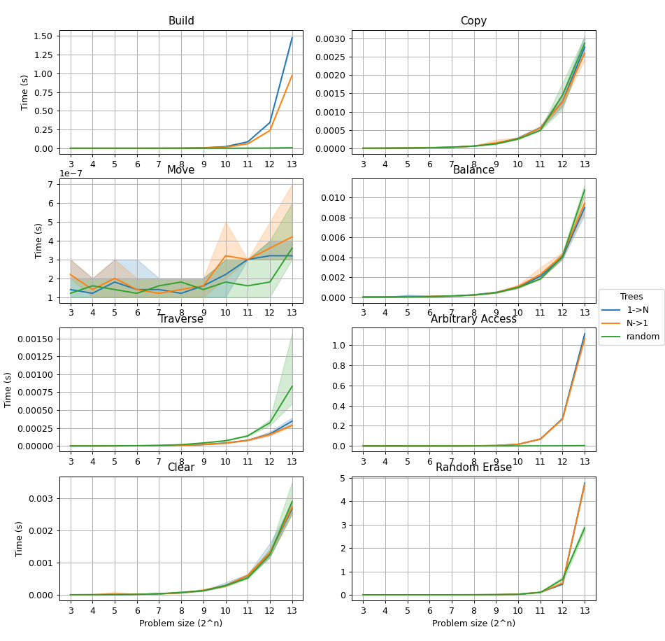

# BST - Advanced Programming exam submission
Student: Michele Rispoli

This project implements a templated BST class and offers two tests to play with it.  
Written in C++14.

## Files overview
- `redme.md` (this one!)
- `include/`
  - `bst.hpp` Header only template library, implementing the bst
  - `bst_tests.hpp` Features an interactive test and a performance test
- `src/`
  - `main.cpp` Runs the interactive test, then the performance test.
- `Makefile` (a very basic one)

## Compiling
Enter the folder and run `make`.  

Tested on Windows 10, compiled with g++ 10.2.0 (Cygwin) using `-std=C++14`.

## Running the code
Launch `bst_test` to run the interactive test. An interactive prompt will pop up giving instructions on what comes next!

## Some performance notes
The code was tested on my personal laptop (CPU:AMD A9-9420, RAM: 8GB DDR3).

The performance tests are ran on 3 separate trees:
- "1->N" is a degenerate tree with a single, huge right arm
- "N->1" is the opposite (that is a single left arm)
- "random" is a randomly generated tree.

More details on the tests can be found in the in-code documentation of `bst_tests.hpp`

Here's a plot of the results:

Some observations:
- **Move** is very cheap (*don't miss the 1e-7 in the top left*), because it simply consists in moving the `root` pointer and copying tree size and height values.
- As imaginable, **Arbitrary access** and **Building** times are much better on the random tree, as in degenerate cases the whole tree has to be traversed for each allocation/access
- Most tests show a slight performance difference between the two degenerate cases, probably due to the order in which left and right children are checked in the various routines.
- **Random erase** is the most costly operation among those tested, immediately followed by **Building** (`emplace()`) and **Arbitrary Access**.

## Other implementation notes
The implementation is possibly not the most efficient nor the most practical.

The `Node` private class includes a pointer to both childrens and parent and uses classic pointers.
This particular choice slightly complicated memory handling (e.g. in erase()) although allowed to perform traversal starting
from the current node instead of root.  

Please check in-code documentation for further details.